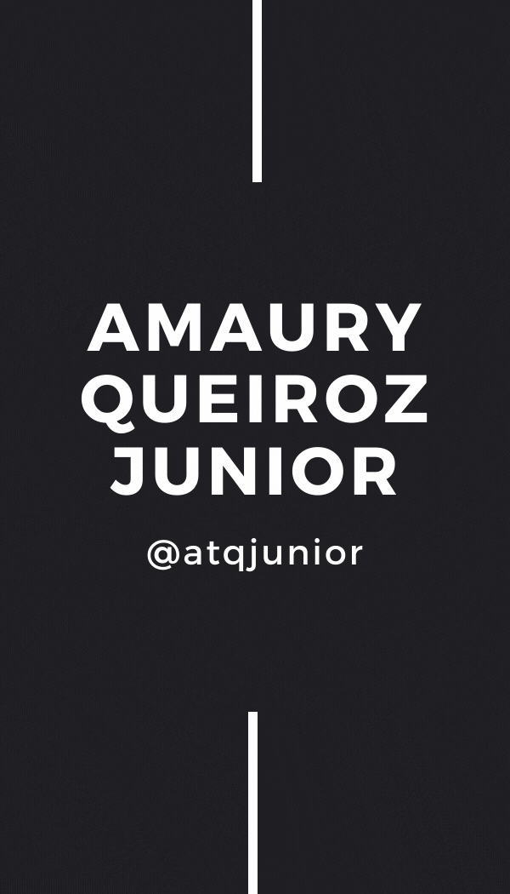

<h1 align="left">Olá , eu sou Amaury Queiroz Jr</h1>

  

### 👨‍💻 Estudante de Desenvolvimento Web na [Trybe](https://www.betrybe.com/)
### 🇧🇷 Atualmente moro em Fortaleza/Ce, Brasil 
### 💬 Pergunte-me sobre ** JavaScript, HTML, CSS, React, Context API **
### ⚡ Curiosidades: Estar com a Família e Amigos, tocar (violão) e cantar, viajar, fotografar;
### 😄 Pronomes: Ele / Dele

 

## 🌱 Atualmente estou estudando sobre ...&nbsp;

 

&nbsp;
&nbsp;
&nbsp;
&nbsp;
&nbsp;
&nbsp;
&nbsp;
&nbsp;
<!-- &nbsp; -->
<!-- &nbsp; -->
<!-- &nbsp; -->

 

## **Sobre mim**

Estou em busca de me tornar um desenvolvedor web full stack, sou aficionado por tecnologia, amo codar, resolver problemas, aprender novas linguagens e estar com a família no meu tempo livre. 🚀 Também me aventuro como designer e fotógrafo...🤝 Estou diariamente desenvolvendo minha comunicação, empatia, colaboração, dar e receber feedbacks, aprender a aprender para ser um profissional e uma pessoa melhor. 💼 Estou em busca de oportunidades para desenvolver meus conhecimentos e aprender mais e mais...

 

## **Você pode me encontrar aqui!**

* 💬 Fique a vontade para me chamar, ficarei muito feliz em poder ajudar;
* 📫 Se quiser pode enviar um email para amaury.tqj@gmail.com
* 📝 Veja meu <a href="https://https://www.linkedin.com/in/atqjunior/" target="_blank">Linkedin</a> para mais informações.

 

## **GitHub Analytics**

  

  

 

## **Redes Sociais**

 

